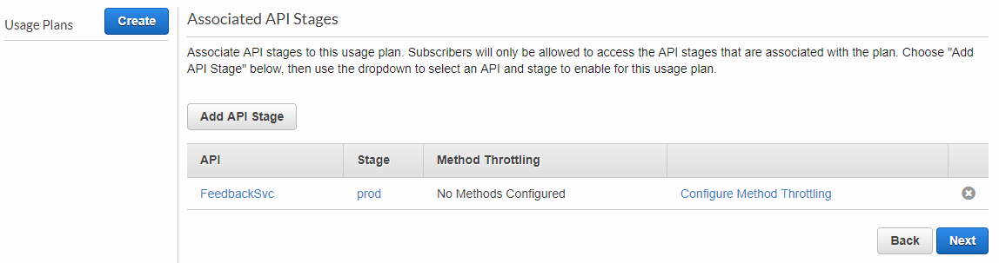
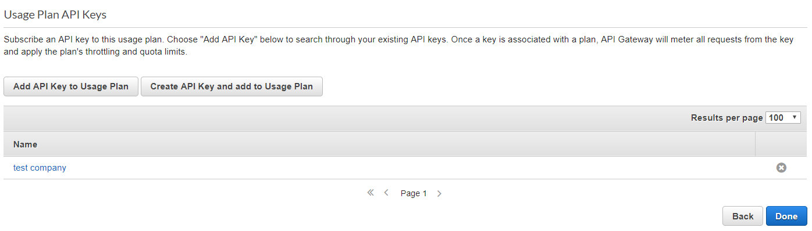

# Usage Plan
Time Estimate: 10 - 15 minutes

In the previous module, we used AWS WAF to enforce rate limiting for our API. You can also leverage Usage Plans with Amazon API Gateway to set limits on the request rate for specific consumers of your API. This can help to protect it from being abused by a particular misbehaving client.

To tally the number of requests that a certain caller is making, API Gateway uses *API Keys* to keep track of different consumers of your API. In our use case, let's assume that we want requests coming from different companies can be calculated separately. 

For more information on how to create and use usage plans with API keys, see our documentation here: https://docs.aws.amazon.com/apigateway/latest/developerguide/api-gateway-api-usage-plans.html. 

## Create an API Gateway usage plan 
1. In the [API Gateway console](https://console.aws.amazon.com/apigateway/home), click the **Usage Plans** link on the left, and click **Create**. 
1. Fill in the details for the usage plan as follows:
	
	* **Name**: ```Basic```
	* **Description** : ```Basic usage plan for partners```
	* **Enable throttling**: leave checked
	* **Throttling Rate** : ```1``` request per second
	* **Throttling Burst** : ```1``` requests 
	* **Enable Quota**: leave cheacked and use ```100``` requests per ```month```

	
	
	Click **Next**.
	
1. Now to associate the API we created previously with our new usage plan:
	* Click the button __Add API Stage__
	* Select __FeedbackSvc__
	* Pick `prod` stage
	* Click the checkmark to confirm, then click **Next**

	


1. We now need to set up API keys to track usage against this plan. In this step, click **Create API Key and add to Usage Plan** to create an API key for users.

	* For Name, pick any name e.g.  `test company`
	* For API Key, select **Auto Generate**
	* Click **Save**

  	

	
1. After the API key has been created, click **Done**.

	
	
## Update API Gateway to enforce API keys

Now, we need to modify our API gateway so requests must have an API key present.

1. In the [API Gateway console](https://console.aws.amazon.com/apigateway/home), navigate to the **FeedbackSvc** API --> **Resources**. Select the first GET method underneath **/feedback** and click on **Method Request**. 

2. Set **API Key Required** field to `true` and click the checkmark to confirm.
  

3. Deploy the API again to the __prod__ stage.

## Test request with API keys

1. Now let's go back to your terminal in Cloud9 and use curl to invoke the API. Now that the API is enforcing API keys, the request should fail if you don't include the API key header.

	Try sending the following request like you did before. You should see the request fail with a `{"message": "Forbidden"}` response.

	```bash
	curl $API_ENDPOINT
	```

2. Now let's make a request using our created API key. First, to find your auto-generated API key value, go to the **API Keys** tab in the API gateway console --> click on the API key you created in previous steps --> click **Show** next to **API Key**:

	

	You can then add the API key request header when using curl like this:
  
	```bash hl_lines="1"
	# Important: change the api key to your own key
	API_KEY=7J5UvskjNg7VAXSaye2P66u04KYWDEDhaHoEPkox
	```
	```bash
	curl -s -H"x-api-key: $API_KEY" $API_ENDPOINT | jq
	```
	
	You should now see the request go through.

## Extra credit

If you want extra credit (karma points), here are some ideas:

* Try viewing/downloading the usage data for a given client. 
	
	> **Hint**: See [here](https://docs.aws.amazon.com/apigateway/latest/developerguide/api-gateway-create-usage-plans-with-console.html#api-gateway-usage-plan-manage-usage) on some documentation 

* Try configure different throttling thresholds for different API methods

	> **Hint**: See [here](https://docs.aws.amazon.com/apigateway/latest/developerguide/api-gateway-request-throttling.html#apig-request-throttling-stage-and-method-level-limits) on some documentation 
