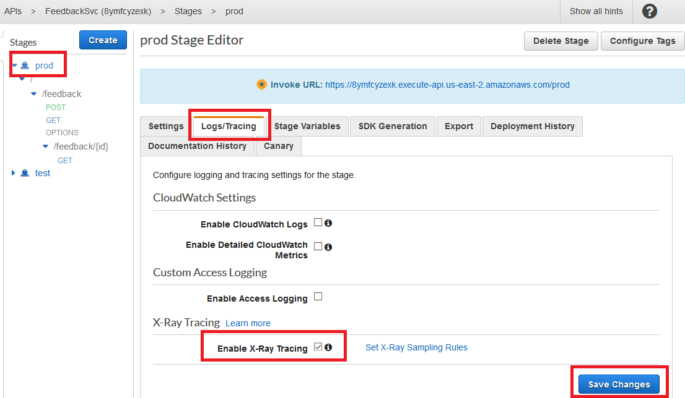
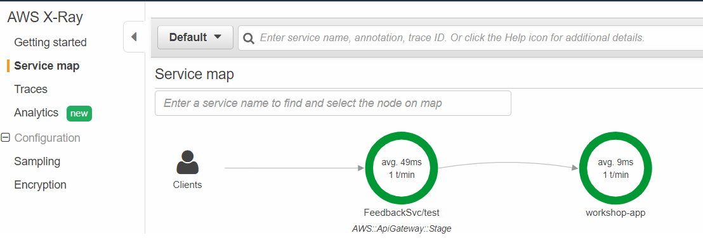
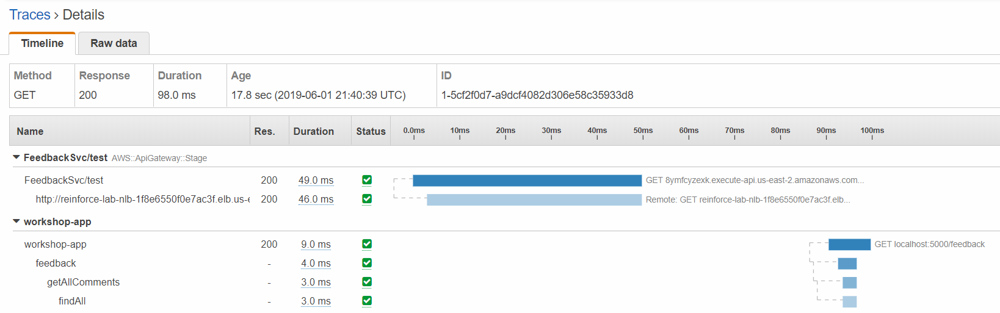

# AWS X-Ray
Time Estimate: 10 - 15 minutes

"Insufficient Logging & Monitoring" is one of the Top 10 Application Security Risks ranked by [OWASP](https://www.owasp.org/index.php/Main_Page) in 2017. Let's try to alleviate this by implementing AWS X-Ray.

## Tracing via AWS X-Ray
AWS X-Ray gives you visibility into the data flow of your microservices architecture and a map of how your application’s underlying components are connected. It's a great tool to troubleshoot performance and debug errors. However, given the ephemeral nature of the infrastructure in a serverless application, this visibility into your application is also critical for the purpose of security:

* It helps you understand the "norm" of the data flow, interdependencies, and performance characteristics of your distributed serverless components. Knowing that is a prerequisite of recognoizing when things are not normal. 
* During a security incident or post analysis, X-Ray can give you insight into what your code is doing at runtime, what downstream dependencies it's making calls to, and where the code is spending its time
 

## Capturing metrics with X-Ray

When our applications makes calls to AWS services, databases, etc., the X-Ray SDK can help to track the calls downstream and record the request timing, status, etc.

To enable this, you can instrument your code to send data to the X-Ray daemon.

Since our backend is a Java Spring boot application, we followed the steps at [AOP with Spring and the X-Ray SDK for Java](https://docs.aws.amazon.com/xray/latest/devguide/xray-sdk-java-aop-spring.html) when instrumenting our backend code.

If you have already downloaded the source code in the previous module, you can right click the __src__ folder for the backend code and search __xray__. You will have the follow search results. Feel free to double click the resutls and view the code.

You can see we created the class XRayInspector and used __@XRayEnabled__ annotation to enable X-Ray tracing. X-Ray tracing has a very low overhead. You can leave it enabled in most situations even for your production environment.


**[Optional] Verify X-Ray daemon**

The X-Ray daemon has already been installed in the backend EC2 instance. We have added IAM permissions to allow the daemon to sned data to the X-Ray service. You can verify if the daemon and application running via session manager.

1. Open session manager, which is under the [__AWS Systems Manager__ console](https://console.aws.amazon.com/systems-manager/session-manager/sessions)

2. Click the button __Start session__

3. Select the __lab-backend__ instance and click __Start session__

4. Run the command
```bash
ps aux|egrep 'java|xray'
```
5. You should be able to see result like the following:


## Enable X-Ray on API Gateway

We'll need to enable X-Ray in API Gateway so that requests will with tracked as they flow through our API.

1. Go to [API Gateway Console](https://console.aws.amazon.com/apigateway/home), and go to the `FeedbackSvc` API.

1. Go to the **Stages** tab, click on the `prod` stage.

1. Find the **Logs/Tracing** tab, check the box for **Enable X-Ray Tracing**, and **Save changes**.

	
	
1. Once saved, redeploy the API by clicking on the **Resources** tab on the left hand side --> **Actions**  --> **Deploy API**  -> Pick the `prod` stage --> **deploy**. 

1. Test by making a few API requests with curl or your browser, for example:
```bash
curl -s $BASE_URL/feedback | jq
```

1. Go to the [**X-Ray console**](https://console.aws.amazon.com/xray/home), go to the **Service map** tab and refresh.

	

1. Explore the service map. Click on various components, and use **View traces** to see a list of request traces captured by X-Ray.

1. Explore the individual traces by clicking into individual requests.

	
